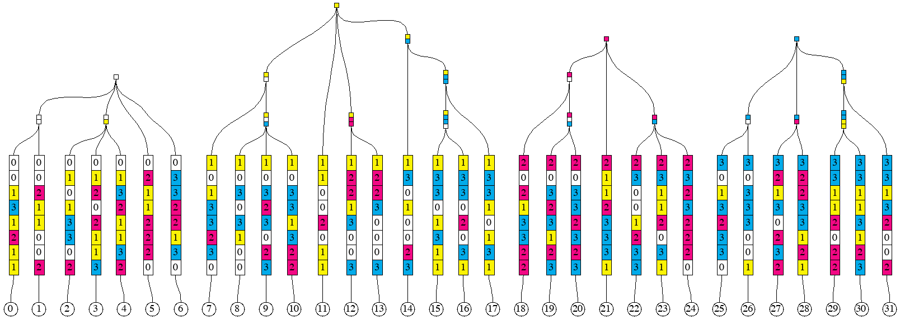
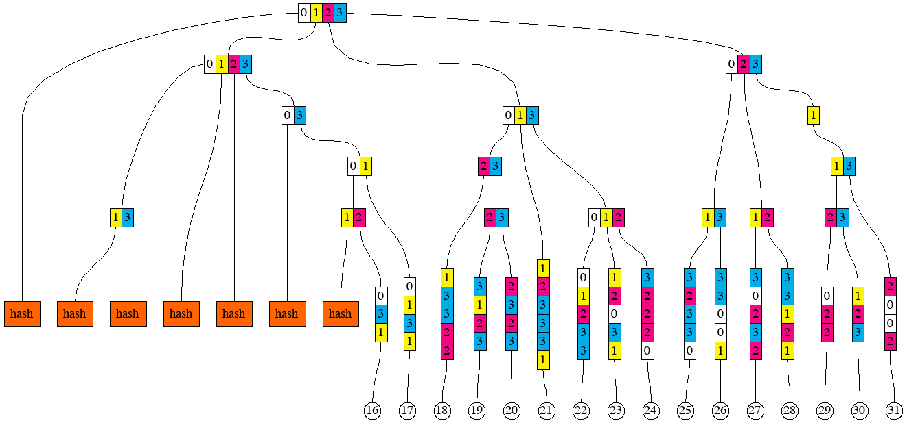
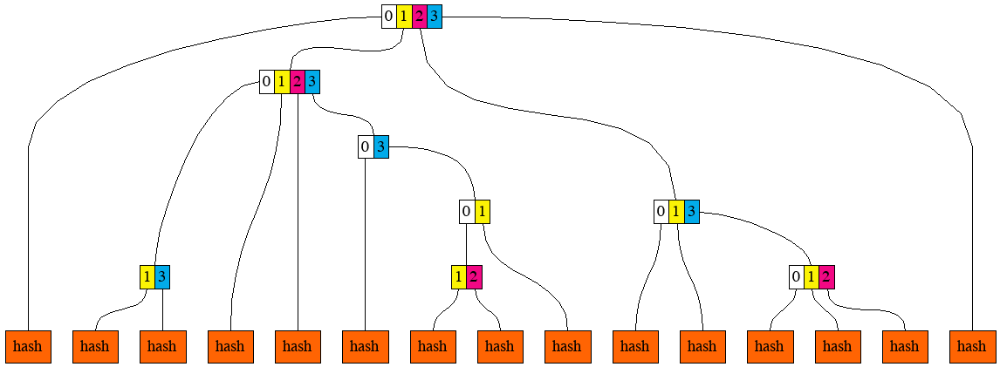

Turbo-Geth programmer's guide
==============================

Ethereum State
--------------
On the high level, Ethereum state is a collection of accounts. An account can be either a non-contract
(also known as "Externally Owned Account", or EOA), or a smart contract.

### Content of an account
Type `Account` [core/state/state_object.go](../../core/state/state_object.go) lists the main components
of an account's content (not identifier):

1. Nonce
2. Balance
3. Root
4. Code hash

#### Nonce
Number of the type `uint64`.

For non-contract accounts, nonce is important in two contexts. Firsly, all transactions signed by an account, have to
appear in the ledger in the order of strictly increasing nonces (without gaps). This check is performed by member function `preCheck` of
type `StateTransition` [core/state_transition.go](../../core/state_transition.go)
Secondly, if a transaction signed by an account is sent to no
particular address (with intention of creating a contract), and it ends up creating a new smart contract account, the adress of such newly
created smart contract account is calcuted based on the current nonce of the "creator" account.
For smart contract accounts, nonce is important when `CREATE` opcode is executed on behalf of such account. This computation is
performed in the member function `Create` of the type `EVM` [core/vm/evm.go](../../core/vm/evm.go). Note the difference between the
member function `Create2`, where the address of the newly created contract is independent of the nonce. For contract accounts,
the nonce is important in the context of creating new contracts via `CREATE` opcode.

#### Balance
Number of the type `*big.Int`. Since balance is denominated in wei, and there 10^18 wei in each Ether, maximum balance that needs to be
representable is 110'000'000 (roughly amount of mainnet Ether in existence, but can be more for testnets and private networks),
multiplied by 10^18, which exceeds the capacity of `uint64`.

#### Root
Binary 32-byte (256-bit) string.

By root here one means the Merkle root of the smart contract storage, organised into a tree. Non-contract accounts cannot have storage,
therefore root makes sense only for smart contract accounts. For non-contract accounts, the root field is assumed to be equal to the
Merkle root of empty tree, which is hard-coded in the varible `emptyRoot` in [core/state/database.go](../../core/state/database.go) and
[trie/trie.go](../../trie/trie.go). For contract accounts, the root is computed using member function `Hash` of
type `Trie` [trie/trie.go](../../trie/trie.go), once the storage of the contract has been organised into the tree by calling member functions
`Update` and `Delete` on the same type.

#### Code hash
Binary 32-byte (256-bit) string.

Hash of the bytecode (deployed code) of a smart contract. The computation of the code hash is performed in the `SetCode` member function
of the type `StateDB` [code/state/statedb.go](../../core/state/statedb.go). Since a non-contract account has no bytecode, code hash only
makes sense for smart contract accounts. For non-contract accounts, the code hash is assumed to be equal to the hash of `nil`, which is
hard-coded in the variable `emptyCode` in [code/state/statedb.go](../../core/state/statedb.go)

### Address - identifier of an account
Accounts are identified by their addresses. Address is a 20-byte binary string, which is derived differently for smart contract and
non-contract accounts.

For non-contract accounts, the address is derived from the public key, by hashing it and taking lowest 20 bytes of the 32-byte hash value,
as shown in the function `PubkeyToAddress` in the file [crypto/crypto.go](../../crypto/crypto.go)

For smart contract accounts created by a transaction without destination, or by `CREATE` opcode, the address is derived from the
address and the nonce of the creator , as shown in the function `CreateAddress` in the file [crypto/crypto.go](../../crypto/crypto.go)

For smart contract accounts created by `CREATE2` opcode, the address is derived from the creator's address, salt (256-bit argument
supplied to the `CREATE2` invocation), and the code hash of the initialisation code (code that is executed to output the actual,
deployed code of the new contract), as shown in the function `CreateAddress2` in the file [crypto/crypto.go](../../crypto/crypto.go)

In many places in the code, sets of accounts are represented by mappings from account addresses to the objects representing
the accounts themselves, for example, field `stateObjects` in the type `StateDB` [core/state/statedb.go](../../core/state/statedb.go).
Member functions of the type `StateDB` that are for querying and modifying one of the componets of an accounts, are all accepting
address as their first argument, see functions `GetBalance`, `GetNonce`, `GetCode`, `GetCodeSize`, `GetCodeHash`, `GetState` (this
one queries an item in the contract storage), `GetCommittedState`, `AddBalance`, `SubBalance`, `SetBalance`, `SetNonce`,
`SetCode`, `SetState` (this one modifies an item in the contract storage) [core/state/statedb.go](../../core/state/statedb.go).

Organising Ethereum State into a Merkle Tree
--------------------------------------------
Ethereum network produces checkpoints of the Ethereum State after every block. These checkpoints come in a form of 32-byte binary
string, which is the root hash of the Merkle tree constructed out of the accounts in the state. This root hash is often
referred to as "State root". It is part of block header, and is contained in the field `Root` of the type
`Header` [core/types/block.go](../../core/types/block.go)

Prior to Byzantium release, the state root was also part of every transaction receipt, and was contained in the field `PostState`
of the type `Receipt` [core/types/receipt.go](../../core/types/receipt.go). Side note: that is why the member function
`ComputeTrieRoots` in the type `TrieDbState` [core/state/database.go](../../core/state/database.go) returns a slice of hashes,
rather than just a single hash. For pre-Byzantium blocks, this function computes state roots for each transaction receipt, and
another one for the block header. For post-Byzantium blocks, it always returns a singleton slice.

### Hexary radix "Patricia" tree
Ethereum uses hexary (radix == 16) radix tree to guide the algorithm of computing the state root. For the purposes of
illustrations, we will use tres trees with radix 4 (because radix 16 requires many more items for "interesting" features
to appear). We start from a set of randomly looking keys, 2 bytes (or 8 quarternary digits) each.


To regenerate this picture, run `go run cmd/pics/pics.go -pic prefix_groups_1`

Next, we sort them in lexicographic order.


To regenerate this picture, run `go run cmd/pics/pics.go -pic prefix_groups_2`

Next, we introduce the notion of a prefix group. Collection of adjacent keys form a prefix group if these keys share
the same prefix, and no other keys share this prefix. Here are the prefix groups for our example:


To regenerate this picture, run `go run cmd/pics/pics.go -pic prefix_groups_3`

The entire collection of keys form one implicit prefix group, with the empty prefix.

Merke patricia tree hashing rules first remove redundant parts of the each key within groups, making key-value
pairs so-called "leaf nodes". They correspond to `shortNode` type in the file [trie/node.go](../../trie/node.go).
To produce the hash of a leaf node, one applies the hash function to the two piece RLP (Recursive Length Prefix).
First piece is the representation of the non-redundant part of the key. And the second piece is the
representation of the leaf value corresponding to the key, as shown in the member function `hashChildren` of the
type `hasher` [trie/hasher.go](../../trie/hasher.go), under the `*shortNode` case.

Hashes of the elements within a prefix group are combined into so-called "branch nodes". They correspond to the
types `duoNode` (for prefix groups with exactly two elements) and `fullNode` in the file [trie/node.go](../../trie/node.go).
To produce the hash of the a branch node, one represents it as an array of 17 elements (17-th element is for the attached leaf,
if exists).
The position in the array that do not have corresponding elements in the prefix group, are filled with empty strings. This is
shown in the member function `hashChildren` of the type `hasher` [trie/hasher.go](../../trie/hasher.go), under the `*duoNode` and
`*fullNode` cases.

Sometimes, nested prefix groups have longer prefixes than 1-digit extension of their encompassing prefix group, as it is the case
in the group of items `12, 13` or in the group of items `29, 30, 31`. Such cases give rise to so-called "extension nodes".
They correspond to `shortNode` type in [trie/node.go](../../trie/node.go), the same type as leaf nodes. However, the value
in an extension node is always the representation of a prefix group, rather than a leaf. To produce the hash of the branch node,
one applies the hash function to the two piece RLP. First piece is the representation of the non-redundant part of the key.
The second part is the hash of the branch node representing the prefix group. This shown in the member function `hashChildren` of the
type `hasher` [trie/hasher.go](../../trie/hasher.go), under the `*shortNode` case.

This is the illlustration of resulting leaf nodes, branch nodes, and extension nodes for our example:


To regenerate this picture, run `go run cmd/pics/pics.go -pic prefix_groups_4`

### Separation of keys and the structure

Our goal here will be to construct an algorithm that can produce the hash of the Patricia Merkle Tree of a sorted
sequence of key-value pair, in one simple pass (i.e. without look-aheads and buffering, but with a stack).
Another goal (perhaps more important)
is to be able to split the sequence of key-value pairs into arbitrary chunks of consequitive keys, and reconstruct the
root hash from hashes of the invidual chunks (note that a chunk might need to have more than one hash).

Let's say that we would like to split the ordered sequence of 32 key-value pairs into 4 chunks, 8 pairs in each. We would then
like to compute the hashes (there might be more than one hash per chunk) of each chunk separately. After that, we would like
to combine the hashes of the chunks into the root hash.

Our approach would be to generate some additional information, which we will call "structural information", for each chunk,
as well as for the composition of chunks. This structural information can be a sequence of these "opcodes":
1. `LEAF length-of-key`
2. `BRANCH set-of-digits`
3. `EXTENSION key`

The description of semantics would require the introduction of a stack, which can contain hashes, or nodes of the tree.

`LEAF` opcode consumes the next key-value pair, creates a new leaf node and pushes it onto the stack. The operand
`length-of-key` specifies how many digits of the key become part of the leaf node. For example, for the leaf `11`
in our example, it will be 6 digits, and for the leaf `12`, it will be 4 digits.

`BRANCH` opcode has a set of digits as its operand. This set can be encoded as a bitset, for example. The action of
this opcode is to pop the same
number of items from the stack as the number of digits in the operand's set, creates a branch node, and pushes it
onto the stack. Sets of digits can be seen as the horizonal rectangles on the picture `prefix_groups_4`.

`EXTENSION` opcode has a key as its operand. This key is a sequence of digits, which, in our example, can only be
of length 1, but generally, it can be longer. The action of this opcode is to pop one item from the stack, create
an extension node with the key provided in the operand, and the value being the item popped from the stack, and
push this extension node onto the stack.

This is the structural information for the chunk containing leafs from `0` to `7` (inclusive):
```
LEAF 5
LEAF 5
BRANCH 12
LEAF 5
LEAF 5
LEAF 5
BRANCH 023
LEAF 6
LEAF 6
BRANCH 0123
LEAF 5
```
After executing these opcodes against the chunk, we will have 2 items on the stack, first representing the branch
node (or its hash) for the prefix group of leafs `0` to `6`, and the second representing one leaf node for the leaf
`7`. It can be observed that if we did not see what the next key after the leaf `7` is, we would not know the operand
for the last `LEAF` opcode. If the next key started with the prefix `101` instead of `103`, the last opcode could have
been `LEAF 4` (because leafs `7` and `8` would have formed a prefix group).

After hashing the first chunk, the tree would look as follows.

To regenerate this picture, run `go run cmd/pics/pics.go -pic prefix_groups_5`

If we apply the same produce to the next chunk of 8 leaves, we will get to the following picture.

To regenerate this picture, run `go run cmd/pics/pics.go -pic prefix_groups_6`

And, after hashing the two remaning chunks.

To regenerate this picture, run `go run cmd/pics/pics.go -pic prefix_groups_7`

Now, if we were given the sequence of these hashes, we need to combine them to produce the root hash.
This needs an introduction on an extra opcode, which takes specified number hash from the sequence (now we can have
two sequences, one with key-value pairs, and another - with hashes), and places them on the stack

4. `HASH number_of_hashes`

```
HASH 3
BRANCH 13
HASH 5
BRANCH 12
HASH 1
BRANCH 01
BRANCH 03
BRANCH 0123
HASH 5
BRANCH 012
BRANCH 013
HASH 1
BRANCH 0123 
```

It can then be readily observed that the first item in any prefix group has this property that its common prefix
with the item immediately to the right (or empty string if the item is the very last) is longer than its common
prefix with the item immediately to the left (or empty string if the item is the very first).
Analogously, the last item in any prefix group has the property that its common prefix with the item
immediately to the left is longer than its common prefix with the item immediately to the right. The consequences
of this observation are that if we were to keep sequences of key-value pairs and hashes in chunks,
the modications of the sequence of key-value pairs in a chunk (insertion of new key or removal
of an existing key) may affect the structural information of an adjusent chunk.

### Multiproofs

Encoding structural information separately from the sequences of key-value pairs and hashes allows
describing so-called "multiproofs". Suppose that we know the root hash of the sequence of key-value pairs for our
example, but we do not know any of the pairs themselves. And we ask someone to reveal keys and value for
the leafs `3`, `8`, `22` and `23`, and enough information to proof to us that the revealed keys and values
indeed belong to the sequence. Here is the picture that gives the idea of which hashes need to be provided
together with the selected key-value pairs.

To regenerate this picture, run `go run cmd/pics/pics.go -pic prefix_groups_8`

And here is the corresponding structural information:
```
HASH 2
LEAF 5
HASH 1
BRANCH 023
HASH 2
BRANCH 0123
HASH 1
LEAF 4
HASH 2
BRANCH 023
BRANCH 13
HASH 3
BRANCH 0123
HASH 2
LEAF 5
LEAF 5
HASH 1
BRANCH 012
BRANCH 013
HASH 1
BRANCH 0123
```

We can think of a multiproof as the combination of 3 things:

1. Sequence of those 4 key-value pairs
2. Sequence of 15 hashes
3. Structural information that lets us compute the root hash out of the sequences (1) and (2)
